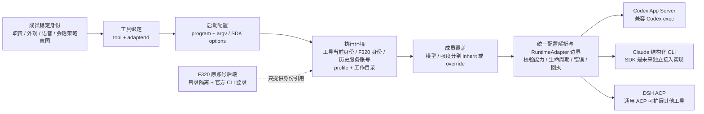
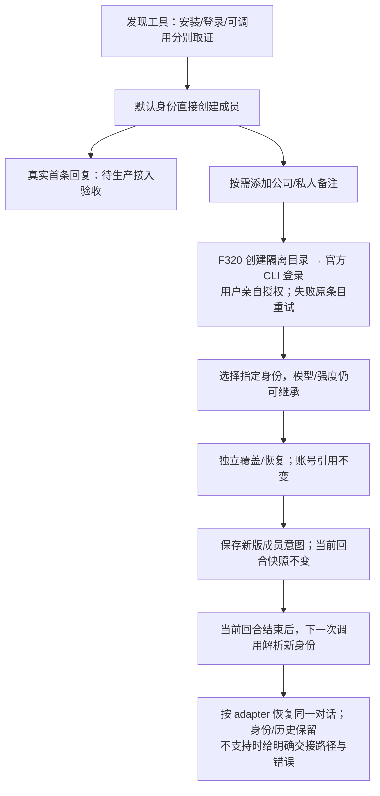

# #1466 v2：成员配置契约、执行身份与接入方式

本方案接续 [zts 的 F320 旅程要求](https://github.com/zts212653/clowder-ai/issues/1466#issuecomment-6093529210) 和 [mind 的字段保留及接入契约意见](https://github.com/zts212653/clowder-ai/issues/1466#issuecomment-6094662266)。
当前产物是三套共用语义的可交互原型和实施方案，不是生产接入或整个 #1466 的完成声明。

## 1. 问题与目标

用户已配好 CLI，添加成员仍被迫理解供应商和认证；旧 kitcoding 标签又无法说明实际调用来源。
上一版简化了普通入口，但原型遗漏既有字段，单一「本机／指定账号」也无法清楚表达公司 OAuth 身份下继续继承模型。

目标：普通路径选择工具即可保存；有需要再选身份、独立覆盖模型/强度；编辑任何一组不能抹掉其他组。
配置意图、调用预览与实际采用回执分别展示。新增 adapter 通过能力声明扩展，不让用户自行猜协议。

## 2. 五个独立维度



工具不等于 adapter，不等于启动程序，更不等于模型 API provider。
`configurationSource` 可继续作为旧系统兼容字段；不能单独代表上述组合。
`native_tool + oauthIdentityRef=公司 + model=inherit + effort=low` 是合法组合。
恢复模型/强度只清该字段覆盖，不解绑账号、profile、接入方式，也不改其他成员。

建议逻辑契约（在现有字段上逐步投影，不要求全量 schema 重写）：

```ts
type Preference<T> = { mode: 'inherit' } | { mode: 'override'; value: T };
type ExecutionBinding =
  | { kind: 'tool_current' }
  | { kind: 'oauth_identity'; identityRef: string }
  | { kind: 'managed_account'; accountRef: string };
interface MemberRuntimeIntent {
  toolId: string;
  adapterId: string;
  launch?: { program?: string; argv: string[] }; // SDK 可无此项
  execution: ExecutionBinding;
  profile?: string;
  model: Preference<string>;
  effort: Preference<string>;
  speed?: Preference<string>;
}
```

原型为了对照既有字段仍用空串表示继承，`executionIdentity` 与 `mode/account` 分开存储；
正式接口的身份引用以 F320 已有实现为准，不能把原型 UUID 当后端账号 ID。
执行环境目录由账号后端拥有，前端不接受随意填写 OAuth 目录，不传或复制凭据。

## 3. 字段保留／迁移／废弃对照

依据现有 `packages/shared/src/types/cat-breed.ts`、`hub-cat-editor.model.ts`、`hub-cat-editor-advanced.tsx`。

| 配置域 / 既有字段 | v2 入口和处理 | 正式实施要求 |
|---|---|---|
| ID、稳定身份关联、name/displayName/nickname、mentionPatterns | 名称/昵称/别名可编辑；其余未编辑字段保留 | 换工具不创建新 ID；别名变更须显式，历史成员引用保持稳定 |
| roleDescription、personality、strengths/teamStrengths、caution、模板 | 用途、补充职责、个性、擅长、限制；不编辑的扩展原样保留 | 只改名字不能重新生成自定义职责；#768 模板推荐不等于强制工具/模型绑定 |
| avatar、color.primary、color.secondary | 个性中折叠外观；主色和派生气泡预览 | 主色是编辑来源；旧 secondary 兼容保留，不增设重复背景色字段 |
| clientId、codexCarrier、acpEnabled、transport | 高级「接入方式」；旧 ACP 明确显示 ACP | adapter 由显式配置与旧 resolver 确定，不根据程序名或 clientId 自动迁移 |
| acpCommand/acpStartupArgs、commandArgs、cliConfigArgs、profile | 程序＋JSON argv；CLI 扩展可见，未映射字段保留 | 程序/参数数组分别序列化；不经过 shell 猜协议；保留未知扩展、transport、池/TTL |
| accountRef/provider/endpoint、F320 身份引用 | 默认沿用工具当前身份；Codex 身份管理按需展开；历史服务账号在高级组 | OAuth 与 API-key 账号分开引用；切来源是显式动作，不因恢复继承清绑定 |
| defaultModel、cli.effort、codexSpeed | 模型/强度独立继承和覆盖；速度属工具能力扩展 | 空值不被模板、getter 或启动参数回填；目录建议只展示或显式采纳 |
| contextWindow / 旧 cli.contextWindow | 独立「上下文与交接」，Auto / 正整数 | 沿既有迁移规则读取旧字段；Auto 不复制推荐值；本轮不重做迁移 |
| sessionChain、sessionStrategy | 会话链、策略、阈值、交接深度、封存、混合次数 | turnBudget、安全余量及压缩扩展等未提供编辑的字段仍原样保留；能力不足明确提示 |
| voiceConfig.* | 独立折叠语音：voice、语言、速度、参考音频/文本、指令、温度 | 不随 tool 变更清除；按语音服务能力渲染，不宣称原型已生成音频 |
| mcpSupport、权限、沙箱 | 连接组 MCP 和权限；沙箱等未编辑字段保留 | MCP/权限由 adapter 声明能力和真实校验，不能 UI 保存即宣称授权完成 |
| 不认识的扩展字段 | 原成员完整克隆，修改明确字段 | 正式后端使用字段 patch 与 revision 校验，不能以简化表单整对象替换并丢字段 |

本轮没有废弃能力；只收起低频入口。颜色派生值不再作为重复输入，旧值仍兼容读取。
正式保存需按“原对象＋明确字段 patch”合并；嵌套对象只更新目标键，保留同组未知键。
`inherit` 的删除/清空应按现有后端契约显式编码，不把「未传字段」混同「清除覆盖」。
取消不写入；转换旧服务账号前显示改动摘要，共享账号不删除；既有覆盖继续作为独立偏好保留。

## 4. Adapter 与启动配置

| 入口 | 本期定位 | 启动/能力边界 |
|---|---|---|
| Codex App Server | 默认，复用已有 CodexAppServerClient | `codex app-server`；原生配置、thread/turn、回执；身份隔离和配置缓存必须按执行环境划分 |
| Codex exec | 保留既有兼容入口 | `codex exec`；独立登记取消、恢复、事件和模型/强度能力，不伪装 App Server |
| Claude 结构化 CLI | 复用已有执行链 | `claude -p` stream-json；必要参数由 adapter 管理，保留原设置范围和认证 |
| Claude Agent SDK | 未接入，原型禁用显示 | 未来独立 adapter；不暴露通用启动 command，不把 SDK 当 CLI 格式开关 |
| DSH ACP | 复用现有安装和 profile | 保留实际 program/argv；ACP 没有适用于所有工具的统一默认 command |
| OpenCode 原生 / 通用自定义 ACP | 扩展设计，非本轮新增实现 | 原生固定入口的现实限制需明示；只有完整满足所选契约的程序才能复用该 adapter |

自研程序能复用 adapter 的前提是：参数契约、握手、事件、续聊、取消、权限与错误都兼容。
事件格式相似不足以证明兼容。协议不匹配需返回 adapterId、阶段、脱敏启动摘要和可诊断错误；
不得偷偷改成默认程序或另一 adapter。原型提供错误场景演示，不宣称已启动自研程序。
接入方式切换是显式操作，按组合保存专属草稿；只换名字不动旧启动信息。
能力目录建议细分 model/effort/speed、resume/cancel、context/策略、MCP/permissions、身份隔离。
目录未声明或未知的能力不能显示为已执行；仍保留用户原配置意图，调用前校验并报错。

## 5. F320 六步旅程与回合边界



保存换号不能打断正在跑的回合，也不能以「换号」为理由删除历史或重建成员。
后续调用读取新配置 revision；旧执行环境释放/复用、native session 恢复由 adapter 决定。
换号与清模型覆盖是两个动作；某 adapter 需要重建 native session 才能清覆盖时，应明确告知，
保持 Clowder 对话历史并走已支持的交接路径，不能泛化成“换号必须新开 Clowder 对话”。
并发回合应冻结 executionIdentity、adapter 和偏好快照，防止全局账号切换串到另一成员。
指定身份失效/删除时显示不可用并阻止调用，不能静默回退到默认账号。

## 6. 对接缺口与实施顺序

F320 Codex 实现已由维护者确认合入内部主线；公开 spec 不能证明此 feature 基线有同等后端。
本轮不另建 OAuth 后端，不修改本机登录，也不接管 Claude 多账号或按项目自动选身份。
需与原实施线对齐以下接口能力（逻辑需求，非宣称这些 endpoint 已存在）：

1. 列举身份：稳定 ID、备注、工具、登录状态/证据来源；列表不包含凭据。
2. 添加/重试登录：创建隔离环境，返回授权交接、进度/失败原因；沿原账号条目重试。
3. 保存成员引用：校验身份所有权与兼容工具；与模型/强度 inherit 独立持久化。
4. 调用解析：按账号目录/profile/cwd 读取原生配置；不复用另一个身份的进程、目录或缓存。
5. 会话转换：回合后换绑、恢复或可解释交接；运行回执带身份引用、配置 revision 与实际采用值。
6. 探测与回执：installed/authenticated/invocable 分别提供已知/未知/失败状态，不用 boolean 合并。

顺序：字段对照与无损 patch → adapter/启动边界 → 同源 F320 账号选择与登录交接 →
三 runtime 真调用及兼容回归 → 首启接入同一创建服务 → #1466 演示/前台交接 → PR、独立 review 后合入。
现有实施分支为 `feat/native-agent-role-config`，本轮只改文档/原型，没有新增生产 PR，也没有部署 runtime。

## 7. 验证与参考

原型测试分两套：原有 30 项创建/覆盖/取消/异常/mobile；新增 30 项身份、回合快照、字段无损、
旧 ACP、启动 argv、上下文 Auto、语音与能力提示。均逐 A/B/C 操作 DOM、保存、刷新并核对浏览器状态。
后续新增边界检查单独记录，截图仅作为布局证据，不替代行为断言。

| 验收层 | 当前证据 | 仍需验收 |
|---|---|---|
| 原型 | 本地浏览器真实表单与持久化、三候选、移动端；离线 HTML | 用户选择信息架构 |
| 身份/会话 | 授权成功/失败、换号与回合快照仅为演示状态机 | 真 OAuth 登录、原账号隔离、换号续聊、刷新后真身份 |
| 运行配置 | 显式覆盖、继承、能力与错误提示 | Codex/Claude/DSH 真实采用回执、cc-switch 环境变更、策略执行 |
| 兼容 | fixture 未编辑字段、旧 ACP 和含空格路径往返 | 真实旧成员导入、后端 patch、多进程隔离、回归现有 DSH |

沿用上一报告已核对的参考：Magpie（能力控件与高级展开）、CC Switch（工具/provider 配置所有权）、
Multica（角色/runtime 分离、探测与继承）、DSH/ACP（profile、配置选项和恢复）、
Codex App Server（原生会话/配置/事件）、Zed external agents（工具管理原生认证）。
本轮新增结论来自 issue 回复与本仓字段，不新增未经证实的外部产品能力。
参考详情及固定源码锚点见 [原架构报告](./issue-1466-runtime-architecture.md)；本 v2 优先于其中旧账号与生效时机表述。